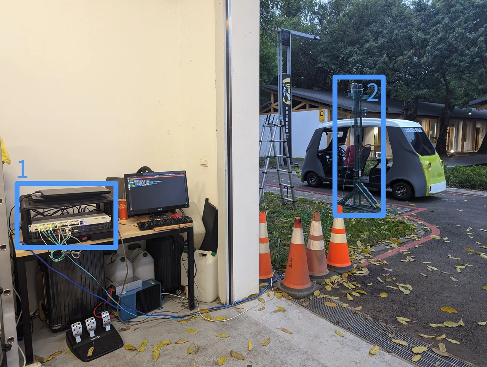
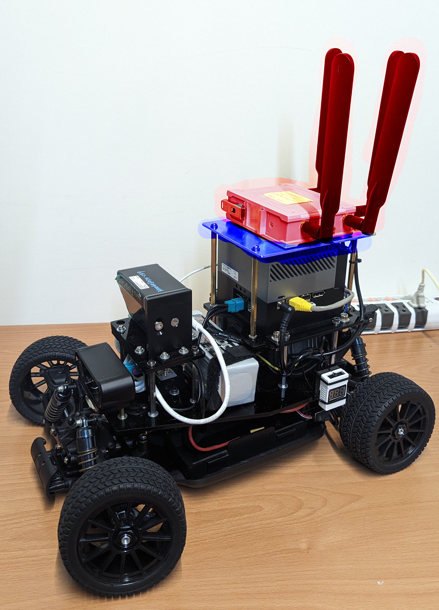

# 5G/LTE Deployment

## The 5G/LTE Infrastructure

Figure 1 shows an example setup of the private 5G infrastructure in
the outdoor based on Ataya Harmony system. The system has two parts in
the figure:

1. The Ataya 5G core network box and
2. Askey small cell base station
3. The vehicle in Figure 2 has a 5G cellular gateway installed on the top dock.

<figure style="width: 80%; text-align: center; margin: auto;">
	
	<figcaption>Figure 1. 5G core network and antenna setup example.</figcaption>
</figure>

<figure style="width: 50%; text-align: center; margin: auto;">
	
	<figcaption>Figure 2. 5G cellular gateway installation example.</figcaption>
</figure>

