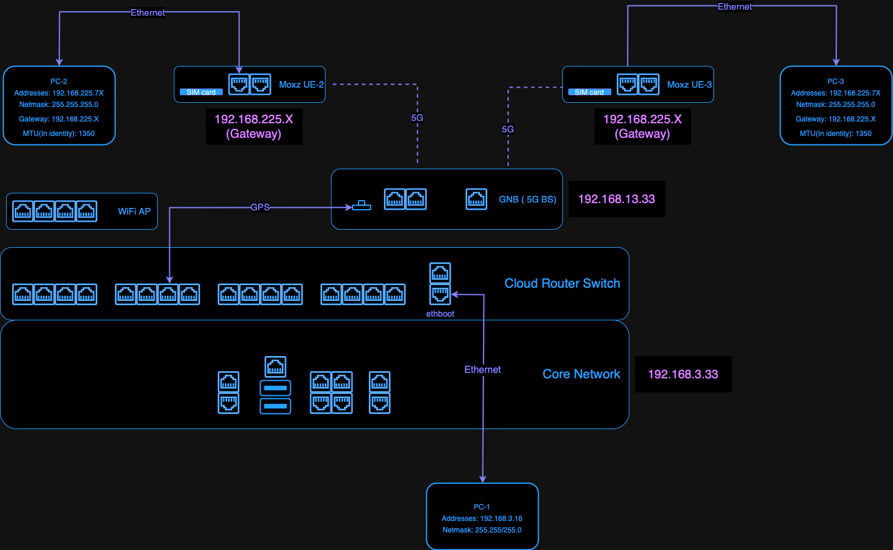

# 5G/LTE Deployment

## Outdoor Setup Example

Figure 1 shows an example setup of the private 5G infrastructure in the outdoor based on Ataya Harmony system. The system has several parts:

1. The Ataya 5G core network box ("1" in Figure 1)
2. Askey small cell base station ("2" in Figure 1)
3. MOXA 5G cellular gateway installed on the vehicle top (Figure 2)

<figure style="width: 80%; text-align: center; margin: auto;">
	
	<figcaption>Figure 1. 5G core network and antenna setup example.</figcaption>
</figure>

<figure style="width: 40%; text-align: center; margin: auto;">
	
	<figcaption>Figure 2. 5G cellular gateway installation example.</figcaption>
</figure>

5G signal range can extend up to 600 meters. Compared to Wi-Fi, it maintains stable latency and bandwidth within that area regardless of the distance to the base station.

When setting up 5G equipment, there are several points to consider. First, the 5G receiver in a vehicle must be placed on the exterior of the body and not inside to avoid poor reception. Second, buildings near the base station can affect signal range. Base station antennas usually have directional capabilities, so ensure that the vehicle's activity range is within the antenna's coverage area.

## Network Architecture

<figure style="width: 100%; text-align: center; margin: auto;">
	
	<figcaption>Figure 3. Ataya 5G network architecture (example)</figcaption>
</figure>
