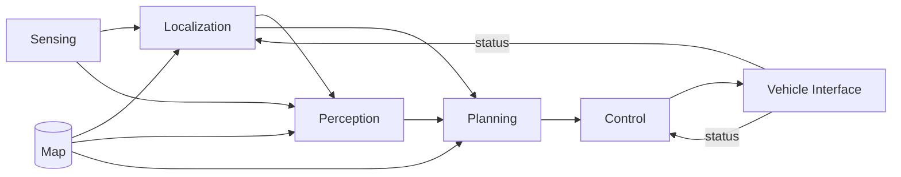

# The Autoware Pipeline, and What Topic Names Tell You

Autoware is organised as a pipeline of components, and **its topic names follow
that organisation**. Once you see that, the output of `ros2 topic list` stops
being a wall of strings and becomes a map of the system.

**Have a system running while you read.** The planning simulation from the
tutorial is enough, and it costs one command:

```bash
just coss planning-sim     # then, in a second terminal with the environment sourced:
ros2 topic list | sort     # the pipeline below, as names
```

## The pipeline



| Component | Consumes | Produces | In AutoSDV |
|---|---|---|---|
| **Sensing** | raw sensor data | cleaned, deskewed point clouds; IMU; GNSS | drivers plus the preprocessing chain |
| **Localization** | point cloud, IMU, wheel odometry, map | the vehicle's pose | NDT, MCL, or visual — see [Localization Methods](../guides/localization-methods.md) |
| **Perception** | point cloud, pose, map, optionally camera | detected and tracked objects | CenterPoint, optionally camera fusion |
| **Planning** | pose, objects, map | a trajectory | Autoware's planning stack |
| **Control** | trajectory, pose, velocity | steering and acceleration commands | MPC lateral, PID longitudinal |
| **Vehicle interface** | control commands | actuator output; vehicle status back | PCA9685 PWM, hall-effect velocity |

Two things are worth noticing in that diagram.

**The map feeds three components, not one.** Localization matches against it,
perception uses it to filter, and planning routes on it. This is why a single
map directory contains several different artefacts — see
[Maps](../guides/maps.md).

**The vehicle interface closes the loop.** It does not only receive commands; it
reports status back, and localization and control both consume that. When
velocity reporting is wrong, the symptom appears in localization.

## Topic names are the pipeline

The first segment of a topic name is the component that owns it:

```
/sensing/lidar/concatenated/pointcloud
/localization/pose_estimator/pose_with_covariance
/perception/object_recognition/detection/objects
/planning/scenario_planning/trajectory
/control/command/control_cmd
/vehicle/status/velocity_status
```

So a topic name tells you which component to look at before you know anything
else about the problem. `ros2 topic list | grep ^/localization` shows you the
localization component's entire interface.

### The namespaces you will meet

| Prefix | Contains |
|---|---|
| `/sensing/` | sensor drivers and preprocessing — `/sensing/lidar/`, `/sensing/imu/`, `/sensing/gnss/`, `/sensing/camera/` |
| `/localization/` | pose estimation and fusion |
| `/perception/` | detection, tracking, prediction |
| `/planning/` | mission, behavior and motion planning |
| `/control/` | trajectory following and command output |
| `/vehicle/` | the vehicle interface; `/vehicle/status/` is what the vehicle reports |
| `/map/` | loaded map data |
| `/system/` | monitoring, diagnostics, emergency handling |
| `/api/` | the external interface — operation mode, routing, engage |

And outside Autoware's own tree, the ROS 2 standards:

| Topic | Meaning |
|---|---|
| `/tf`, `/tf_static` | coordinate frame transforms |
| `/clock` | simulated time, when `use_sim_time` is true |
| `/diagnostics` | node health |

### Reading a name in full

```
/localization/pose_estimator/pose_with_covariance
 └─ component    └─ role        └─ what it carries
```

The middle segment is the *role* rather than the implementation. This matters:
`pose_estimator` is whichever estimator you selected with `pose_source`, so NDT,
CUDA NDT and MCL all publish to the same topic. That is what makes them
interchangeable, and it is the reason switching localization methods does not
require changing anything downstream.

## Frames

Autoware uses a standard frame tree, and the names are as conventional as the
topics:

| Frame | Meaning |
|---|---|
| `map` | the fixed world frame the map is in |
| `odom` | a continuous, drift-prone frame; smooth but not globally correct |
| `base_link` | the vehicle body, at the centre of the rear axle |
| sensor frames | e.g. `velodyne`, `zed_camera_link`, positioned relative to `base_link` |

The chain is `map → odom → base_link → sensor`. Localization provides
`map → odom`; wheel and IMU odometry provide `odom → base_link`; the sensor kit's
calibration provides the rest, and that last part is static.

A useful consequence: if a sensor is mounted 0.5 m forward of `base_link`, that
offset lives in TF, and anything that reasons about the vehicle's position must
account for it. Components that quietly assume the sensor *is* the vehicle
produce a constant offset — which is exactly the failure mode the MCL scan
normalizer exists to prevent.

## Message types

The types follow the same pattern — `autoware_*` for Autoware's own, standard
ROS types elsewhere:

| Type | Used for |
|---|---|
| `sensor_msgs/PointCloud2` | LiDAR |
| `sensor_msgs/Imu`, `sensor_msgs/NavSatFix` | IMU, GNSS |
| `geometry_msgs/PoseWithCovarianceStamped` | estimated pose |
| `autoware_perception_msgs/PredictedObjects` | tracked objects |
| `autoware_planning_msgs/Trajectory` | the planned path |
| `autoware_control_msgs/Control` | steering and acceleration |

!!! warning "`autoware_auto_*` is the old naming"

    Older Autoware used `autoware_auto_msgs`. Autoware 1.5.0 does not define
    those types at all, so a rosbag recorded against them will replay without
    error and satisfy no subscriber. The Leo Drive dataset needs migrating for
    exactly this reason — see [Datasets](../running/datasets.md).

## Using this to debug

The naming turns a vague failure into a bisection. Work along the pipeline and
find the first component whose output is missing or wrong:

```bash
ros2 topic hz /sensing/lidar/concatenated/pointcloud            # is sensing alive?
ros2 topic hz /localization/pose_estimator/pose_with_covariance # is a pose coming out?
ros2 topic echo /planning/scenario_planning/trajectory --once   # is there a plan?
ros2 topic echo /control/command/control_cmd --once             # is a command issued?
```

The first one that is silent is where the fault is, and everything downstream of
it is a symptom rather than a cause. "The vehicle will not move" is a control
question only if planning is producing a trajectory.

## Next

- [Inspecting a Running System](./inspecting.md) — the commands above, in detail
- [Localization Methods](../guides/localization-methods.md) — what plugs into the
  `pose_estimator` role
- [Glossary](./glossary.md)
