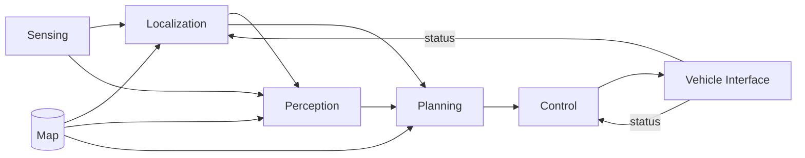

<!--
Translation Metadata:
- Source file: autoware-conventions.md
- Last synced: 2026-09-14
- Translator: Claude (Anthropic)
- Status: Complete
-->

# Autoware 管線，以及主題名稱告訴你什麼

Autoware 是以一條組件管線組織起來的，而**它的主題名稱依循那個組織方式**。一旦你
看出這一點，`ros2 topic list` 的輸出就不再是一堵字串牆，而變成一張系統的地圖。

**邊讀邊讓系統跑著。** 教學裡的路徑規劃模擬就夠了，一道指令而已：

```bash
just coss planning-sim     # then, in a second terminal with the environment sourced:
ros2 topic list | sort     # the pipeline below, as names
```

## 管線



| 組件 | 消費 | 產出 | 在 AutoSDV 中 |
|---|---|---|---|
| **Sensing** | 原始感測器資料 | 清理、去畸變後的點雲；IMU；GNSS | 驅動程式加上前處理鏈 |
| **Localization** | 點雲、IMU、輪速里程計、地圖 | 車輛的姿態 | NDT、MCL 或視覺——參閱[定位方法](../guides/localization-methods.md) |
| **Perception** | 點雲、姿態、地圖，選配相機 | 偵測與追蹤到的物件 | CenterPoint，選配相機融合 |
| **Planning** | 姿態、物件、地圖 | 一條軌跡 | Autoware 的規劃堆疊 |
| **Control** | 軌跡、姿態、速度 | 轉向與加速命令 | MPC 橫向、PID 縱向 |
| **Vehicle interface** | 控制命令 | 致動器輸出；回報車輛狀態 | PCA9685 PWM、霍爾效應測速 |

那張圖裡有兩件事值得注意。

**地圖餵給三個組件，不是一個。** 定位對它做匹配、感知用它過濾、規劃在它上面規劃
路線。這就是為什麼單一地圖目錄裡含有好幾種不同的產物——參閱[地圖](../guides/maps.md)。

**車輛介面閉合了迴路。** 它不只接收命令；它也回報狀態，而定位與控制都會消費那份
狀態。當速度回報錯誤時，症狀會出現在定位上。

## 主題名稱就是管線

主題名稱的第一段就是擁有它的組件：

```
/sensing/lidar/concatenated/pointcloud
/localization/pose_estimator/pose_with_covariance
/perception/object_recognition/detection/objects
/planning/scenario_planning/trajectory
/control/command/control_cmd
/vehicle/status/velocity_status
```

所以一個主題名稱會在你對問題還一無所知之前，先告訴你該看哪個組件。
`ros2 topic list | grep ^/localization` 會顯示定位組件的整個介面。

### 你會遇到的命名空間

| 前綴 | 內容 |
|---|---|
| `/sensing/` | 感測器驅動與前處理——`/sensing/lidar/`、`/sensing/imu/`、`/sensing/gnss/`、`/sensing/camera/` |
| `/localization/` | 姿態估計與融合 |
| `/perception/` | 偵測、追蹤、預測 |
| `/planning/` | 任務、行為與運動規劃 |
| `/control/` | 軌跡跟隨與命令輸出 |
| `/vehicle/` | 車輛介面；`/vehicle/status/` 是車輛回報的內容 |
| `/map/` | 已載入的地圖資料 |
| `/system/` | 監控、診斷、緊急處理 |
| `/api/` | 對外介面——操作模式、路線規劃、engage |

以及 Autoware 樹之外的 ROS 2 標準：

| 主題 | 意義 |
|---|---|
| `/tf`、`/tf_static` | 座標系轉換 |
| `/clock` | 模擬時間，當 `use_sim_time` 為 true 時 |
| `/diagnostics` | 節點健康狀態 |

### 完整讀一個名稱

```
/localization/pose_estimator/pose_with_covariance
 └─ 組件        └─ 角色        └─ 承載什麼
```

中間那一段是*角色*而非實作。這很重要：`pose_estimator` 是你以 `pose_source` 選定的
那個估測器，所以 NDT、CUDA NDT 與 MCL 全都發佈到同一個主題。這正是它們可以互換的
原因，也是切換定位方法不需要改動下游任何東西的原因。

## 座標系

Autoware 使用一套標準的座標系樹，名稱和主題一樣依循慣例：

| Frame | 意義 |
|---|---|
| `map` | 地圖所在的固定世界座標系 |
| `odom` | 連續但會漂移的座標系；平滑但非全域正確 |
| `base_link` | 車體，位於後軸中心 |
| 感測器座標系 | 例如 `velodyne`、`zed_camera_link`，相對 `base_link` 定位 |

這條鏈是 `map → odom → base_link → sensor`。定位提供 `map → odom`；輪速與 IMU
里程計提供 `odom → base_link`；感測器套件的校正提供其餘部分，而最後那段是靜態的。

一個有用的推論：若某個感測器安裝在 `base_link` 前方 0.5 公尺，那個位移存在於 TF
中，任何對車輛位置做推論的東西都必須把它算進去。若有組件默默假設感測器*就是*車輛，
就會產生一個固定偏移——而那正是 MCL 掃描正規化器要防止的失效模式。

## 訊息型別

型別依循同樣的模式——Autoware 自己的是 `autoware_*`，其餘是標準 ROS 型別：

| 型別 | 用於 |
|---|---|
| `sensor_msgs/PointCloud2` | LiDAR |
| `sensor_msgs/Imu`、`sensor_msgs/NavSatFix` | IMU、GNSS |
| `geometry_msgs/PoseWithCovarianceStamped` | 估計的姿態 |
| `autoware_perception_msgs/PredictedObjects` | 追蹤到的物件 |
| `autoware_planning_msgs/Trajectory` | 規劃出的路徑 |
| `autoware_control_msgs/Control` | 轉向與加速 |

!!! warning "`autoware_auto_*` 是舊的命名"

    較舊的 Autoware 使用 `autoware_auto_msgs`。Autoware 1.5.0 根本不定義那些型別，
    所以對著它們錄製的 rosbag 會毫無錯誤地播放完畢，卻滿足不了任何訂閱者。Leo
    Drive 資料集需要遷移正是為此——參閱[資料集](../running/datasets.md)。

## 用這套慣例除錯

這套命名把一個模糊的故障變成一次二分搜尋。沿著管線往前走，找出第一個輸出缺失或
錯誤的組件：

```bash
ros2 topic hz /sensing/lidar/concatenated/pointcloud            # 感測還活著嗎？
ros2 topic hz /localization/pose_estimator/pose_with_covariance # 有姿態出來嗎？
ros2 topic echo /planning/scenario_planning/trajectory --once   # 有規劃嗎？
ros2 topic echo /control/command/control_cmd --once             # 有下命令嗎？
```

第一個沉默的就是故障所在，它下游的一切都是症狀而非成因。「車輛不動」只有在規劃
確實產出軌跡時，才是一個控制問題。

## 接下來

- [檢視執行中的系統](./inspecting.md) —— 上面那些指令的細節
- [定位方法](../guides/localization-methods.md) —— 什麼可以插進 `pose_estimator`
  這個角色
- [詞彙表](./glossary.md)
