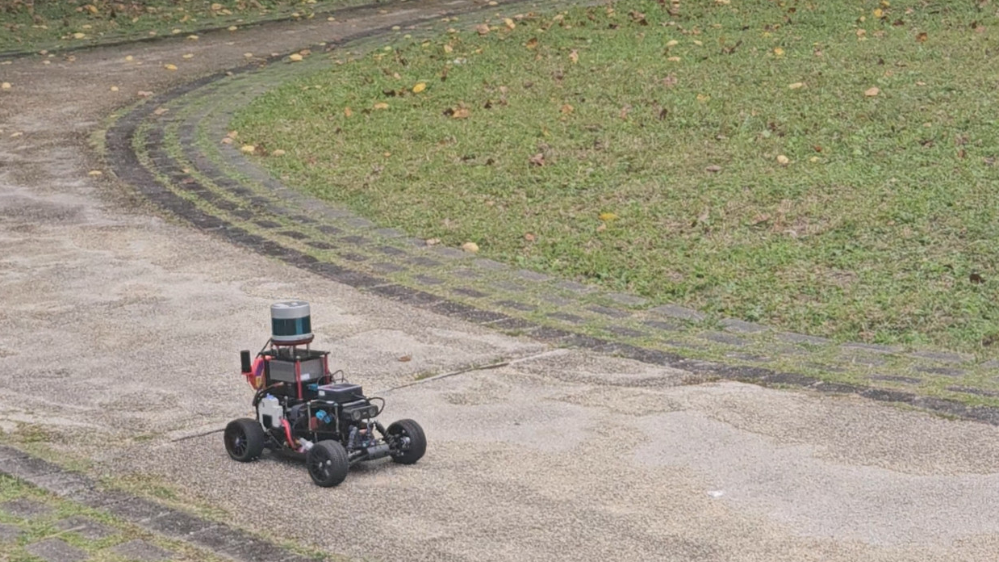
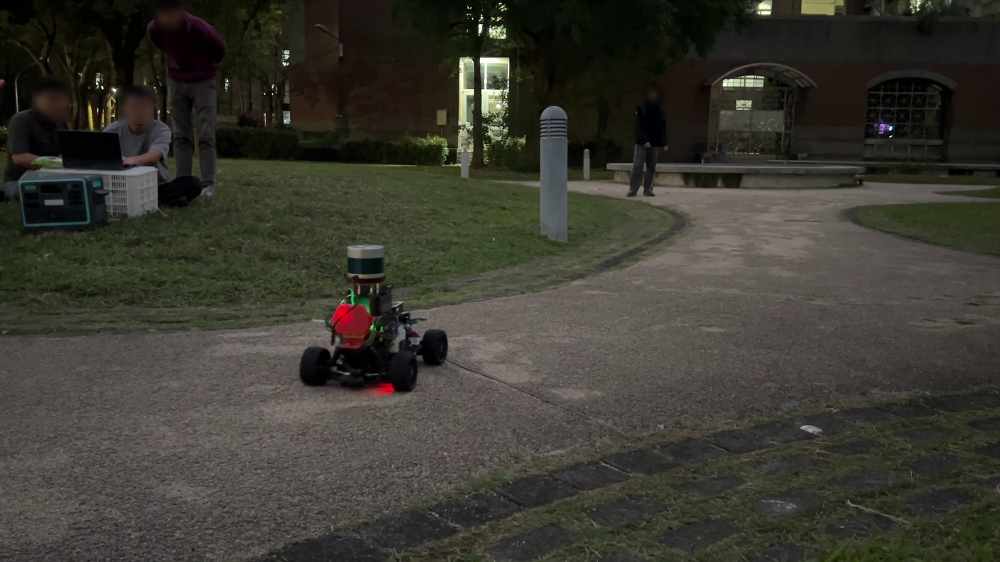

<figure style="text-align: center">
	
</figure>

# AutoSDV Documentation

Welcome to the AutoSDV (Autonomous Software-Defined Vehicle) documentation.

The AutoSDV project, namely the *Autoware Software-Defined Vehicle*, features an affordable autonomous driving platform with practical vehicle equipment for educational and research institutes. This project allows you to build a self-driving platform at home and use it in real outdoor road environments. Driven by Autoware, the leading open-source software project for autonomous driving, it gives you great flexibility and extensibility with the vehicle software.

AutoSDV provides a complete stack from hardware specifications to software implementation, offering an accessible entry point into real-world autonomous systems using industry-standard tools and practices.

<figure style="text-align: center; margin: 1.5em auto; max-width: 640px;">
  <video autoplay loop muted playsinline style="width: 100%; border-radius: 8px;">
    <source src="figures/coss_outdoor_run_video/coss_outdoor_run.webm" type="video/webm">
  </video>
  <figcaption>Autonomous Navigation</figcaption>
</figure>

<table align="center" border="0">
  <tr>
    <td align="center" valign="middle" width="50%">
      <a href="figures/coss_park_outdoor_daytime.png" target="_blank">
        
      </a>
    </td>
    <td align="center" valign="middle" width="50%">
      <a href="figures/coss_park_outdoor_night.png" target="_blank">
        
      </a>
    </td>
  </tr>
  <tr>
    <td align="center">Daytime Operation</td>
    <td align="center">Night Operation</td>
  </tr>
</table>

## Getting Started

This guide walks you through setting up and using the AutoSDV platform. Follow these steps sequentially to build a fully functional autonomous vehicle:

1. **[Hardware Setup](getting-started/hardware-assembly.md)** - Setting up and using the vehicle hardware
2. **[Software Installation](getting-started/installation/overview.md)** - Installing AutoSDV software
   - **[ZED SDK Installation](getting-started/installation/zed-sdk.md)** - ZED camera driver setup
   - **[Automatic Setup](getting-started/installation/overview.md)** - Automated installation (recommended)
   - **[Manual Setup](getting-started/installation/manual-environment.md)** - Advanced customization
   - **[Docker Setup](getting-started/installation/docker.md)** - Containerized installation
3. **[Operating the Vehicle](getting-started/usage.md)** - Launching and controlling the system

### Quick Start Paths

**For Vehicle Deployment**: Follow the steps in order: Hardware Setup → Install → Operate

**For Simulation/Development**: Skip to [Software Installation](getting-started/installation/overview.md) or use [Docker Setup](getting-started/installation/docker.md) for quick testing

**For Customization**: See [Manual Setup](getting-started/installation/manual-environment.md) for advanced configuration options

## Quick Links

- [**Platform Models**](platform-models.md) - Explore different hardware configurations
- [**Guides**](guides/development.md) - Tutorials for developers and operators
- [**Technical Reference**](reference/overview.md) - Detailed technical specifications

## Citation

If you use AutoSDV in your research or educational projects, please cite our work using the following BibTeX entry:

```latex
@misc{autosdv2025,
  author = {Hsiang-Jui Lin, Chi-Sheng Shih},
  title = {AutoSDV: A Software-Defined Vehicle Platform for Research and Education},
  year = {2025},
  institution = {National Taiwan University},
  url = {https://github.com/NEWSLabNTU/AutoSDV},
  note = {Accessed: 2025-04-28}
}
```

## Getting Help

- **Documentation**: You're reading it!
- **Issues**: [GitHub Issues](https://github.com/NEWSLabNTU/AutoSDV-book/issues)
- **Source Code**: [GitHub Repository](https://github.com/NEWSLabNTU/AutoSDV-book)

---

*This documentation is maintained by the AutoSDV project team.*
