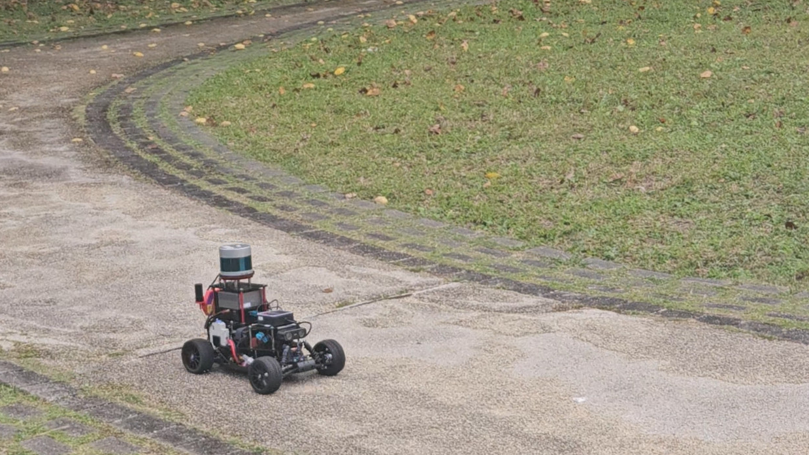
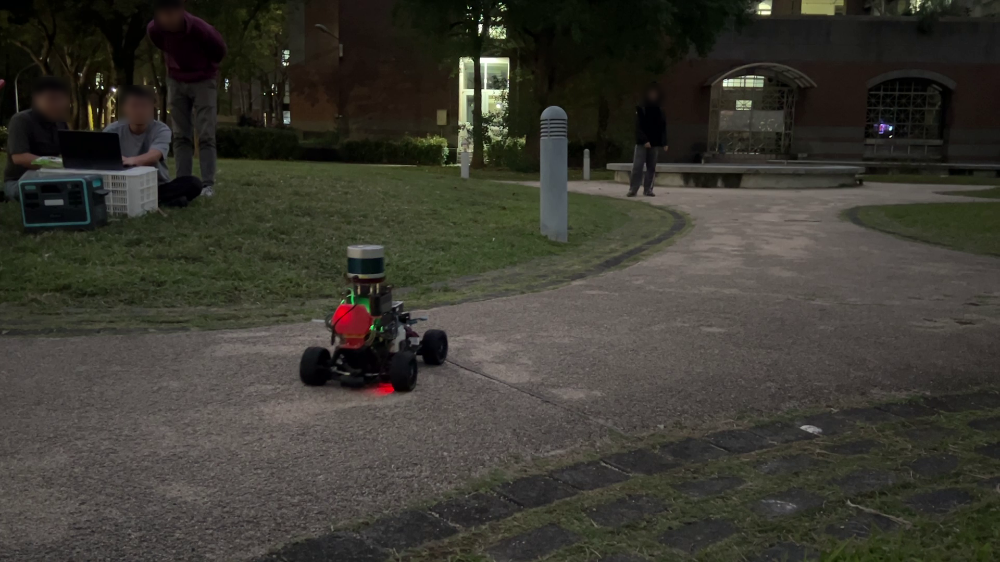

<!--
Translation Metadata:
- Source file: index.md
- Last synced: 2026-09-14
- Translator: Claude (Anthropic)
- Status: Complete
-->

<figure style="text-align: center">
	
</figure>

# AutoSDV 文件

歡迎來到 AutoSDV（自動駕駛軟體定義車輛）文件。

AutoSDV 專案，即 *Autoware 軟體定義車輛*，提供了一個經濟實惠的自動駕駛平台，配備實用的車輛設備，專為教育和研究機構設計。本專案讓您能夠在家中建置自動駕駛平台，並在真實的戶外道路環境中使用。採用領先的開源自動駕駛軟體專案 Autoware 驅動，為車輛軟體提供極大的靈活性和可擴展性。

AutoSDV 提供從硬體規格到軟體實作的完整堆疊，使用業界標準工具和實踐，為真實世界的自動駕駛系統提供易於接觸的切入點。

<figure style="text-align: center; margin: 1.5em auto; max-width: 640px;">
  <video autoplay loop muted playsinline style="width: 100%; border-radius: 8px;">
    <source src="../figures/coss_outdoor_run_video/coss_outdoor_run.webm" type="video/webm">
  </video>
  <figcaption>自動導航</figcaption>
</figure>

<table align="center" border="0">
  <tr>
    <td align="center" valign="middle" width="50%">
      <a href="../figures/coss_park_outdoor_daytime.png" target="_blank">
        
      </a>
    </td>
    <td align="center" valign="middle" width="50%">
      <a href="../figures/coss_park_outdoor_night.png" target="_blank">
        
      </a>
    </td>
  </tr>
  <tr>
    <td align="center">日間運行</td>
    <td align="center">夜間運行</td>
  </tr>
</table>

## 開始使用

### 先在模擬中試玩 —— 不需要車輛

你只需要一台跑 Ubuntu 22.04 的機器，其餘什麼都不用。路徑規劃模擬不需要感測器、
不需要 GPU，也不需要 rosbag。

1. **[軟體安裝](getting-started/installation/overview.md)** —— 在 Ubuntu 或
   Jetson 上建立開發環境
2. **[驗證安裝](getting-started/installation/verify.md)** —— 四項檢查，依它們
   能證明多少事情排序
3. **[開始教學](tutorial/00-what-you-will-build.md)** —— 在模擬中駕駛兩次，
   並理解每一種各自教你什麼
4. **[然後讀基本概念](concepts/environment.md)** —— 環境、啟動檔與 Autoware
   管線，對照你剛剛跑過的那些檔案來讀

### 組裝並駕駛一台車

1. **[硬體設定](getting-started/hardware-assembly.md)** —— 組裝車輛平台
2. **[軟體安裝](getting-started/installation/overview.md)** —— 使用 `vehicle`
   設定檔
3. **[ZED SDK 安裝](getting-started/installation/zed-sdk.md)** —— 如果你有
   ZED 相機
4. **[操作車輛](getting-started/usage.md)** —— 啟動系統、監看與錄製資料

## 探索更多

- [**基本概念**](concepts/environment.md) —— 環境、啟動檔與 Autoware 管線，
  對照你手上已有的檔案來解釋。刻意排在教學**之後**：每一頁都要你打開某個路徑或
  執行某道指令，那需要一份原始碼，而不是想像力
- [**平台型號**](platform-models.md) —— 硬體配置與組裝變體
- [**定位方法**](guides/localization-methods.md) —— `pose_source` 在選擇什麼
- [**感測器整合**](guides/sensor-integration/using-sensors.md) —— 設定 LiDAR、
  相機、IMU、GNSS
- [**車輛控制**](guides/vehicle-control/overview.md) —— 馬達、轉向與 PID 調校
- [**技術參考**](reference/overview.md) —— 規格與配線圖

## 引用

如果您在研究或教育專案中使用 AutoSDV，請使用以下 BibTeX 條目引用我們的工作：

```latex
@misc{autosdv2025,
  author = {Hsiang-Jui Lin, Chi-Sheng Shih},
  title = {AutoSDV: A Software-Defined Vehicle Platform for Research and Education},
  year = {2025},
  institution = {National Taiwan University},
  url = {https://github.com/NEWSLabNTU/AutoSDV},
  note = {Accessed: 2025-04-28}
}
```

## 取得協助

- **文件**：您正在閱讀！
- **問題回報**：[GitHub Issues](https://github.com/NEWSLabNTU/AutoSDV/issues)
- **原始碼**：[GitHub Repository](https://github.com/NEWSLabNTU/AutoSDV)

---

*本文件由 AutoSDV 專案團隊維護。*
