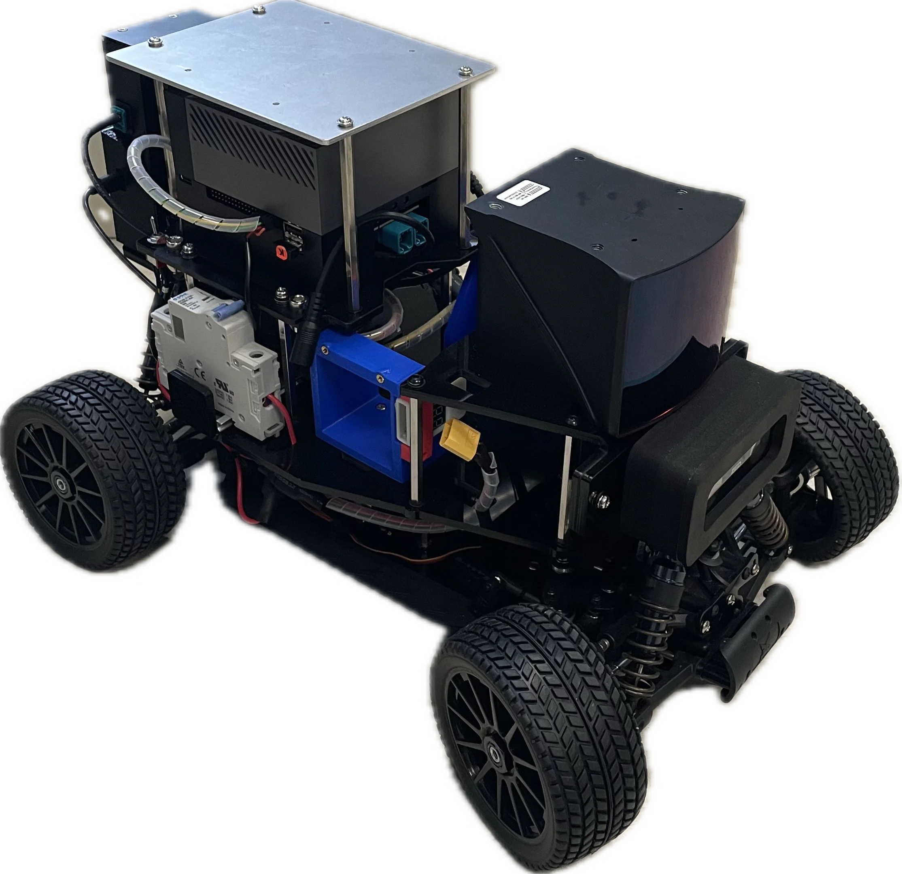

<figure style="text-align: center">
	
</figure> 

The AutoSDV project, namely the Autoware Software Defined Vehicle, features an affordable autonomous driving platform with practical vehicle equipment for educational and research institutes. This project allows you to build a self-driving platform at home and use it in real outdoor road environments. Driven by Autoware, the leading open-source software project for autonomous driving, it gives you great flexibility and extensivity on the vehicle software.

<table align="center" border="0">
  <tr>
    <td align="center" valign="bottom">
      
    </td>
    <td align="center" valign="bottom">
      
    </td>
    <td align="center" valign="bottom">
      
    </td>
  </tr>
  <tr>
    <td align="center">
      <b>Robin-W Solid-State LiDAR Kit</b>
    </td>
    <td align="center">
      <b>Velodyne 32C LiDAR Kit</b>
    </td>
    <td align="center">
      <b>Cube1 LiDAR + MOXA 5G Kit</b>
    </td>
  </tr>
</table>
