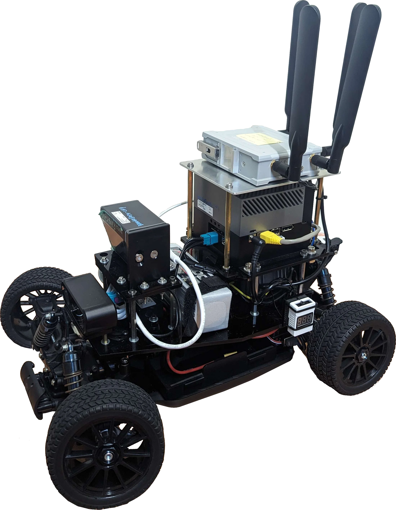

# Platform Models

| Feature              | Base        | 360° LiDAR | Solid-State        | Connected          |
|----------------------|-------------|------------|--------------------|--------------------|
| **LiDAR Model**      | -           | VLP-32C    | Robin-W            | Robin-W            |
| **LiDAR FOV**        | -           | 360° × 40° | 120° × 25°         | 120° × 25°         |
| **LiDAR Range**      | -           | 100m       | 150m               | 150m               |
| **Localization**     | Vision only | NDT ready  | Development needed | Development needed |
| **Remote Operation** | Manual      | No         | No                 | Yes (5G)           |
| **Battery Life**     | 40 min      | 40 min     | 40 min             | 40 min             |

- [Base Model](#base-model) - Core platform for customization
- [360° LiDAR Model](#360-lidar-model) - Production-ready with Velodyne VLP-32C
- [Solid-State Model](#solid-state-model) - Modern LiDAR with Seyond Robin-W
- [Connected Model](#connected-model) - 5G-enabled with a solid-state LiDAR

---

## Base Model

<figure style="width: 50%; text-align: center; margin: auto;">
	
	<figcaption>AutoSDV base platform ready for customization</figcaption>
</figure>

The core AutoSDV platform with compute, vision, and control capabilities. Ideal for vendors integrating their own sensors.

### Core Components

| Component           | Specification                |
|---------------------|------------------------------|
| **Chassis**         | Tekno TKR9500 16×11×5" truck |
| **Computer**        | NVIDIA Jetson AGX Orin 64GB  |
| **Storage**         | 1TB NVMe SSD                 |
| **Camera**          | ZED X Mini Stereo            |
| **ZED Link**        | Capture Card for ZED         |
| **IMU**             | MPU9250 9-axis               |
| **Hall Sensor**     | KY-003 wheel encoder         |
| **Upper Battery**   | 22.2V 6S 5000mAh LiPo        |
| **Lower Battery**   | 7.4V 2S 7200mAh LiPo         |
| **Motor**           | Brushless 4274/1500kv        |
| **ESC**             | 60A Brushless controller     |
| **Servo**           | High-torque digital          |
| **PWM Driver**      | PCA9685 16-channel           |
| **DC-DC Converter** | 24V→12V 10A                  |
| **Circuit Breaker** | 30A safety switch            |

### Available Interfaces

- **Ethernet**: 10GbE port for high-speed LiDAR connection
- **USB**: 4x USB 3.2 Type-A, 2x USB Type-C with USB 3.2
- **GPIO**: 40-pin header with I2C, SPI, UART, PWM
- **PCIe**: M.2 Key M and Key E slots for expansion
- **Display**: DisplayPort

---

## 360° LiDAR Model

<figure style="width: 50%; text-align: center; margin: auto;">
	
	<figcaption>AutoSDV with Velodyne VLP-32C 360° LiDAR</figcaption>
</figure>

Production-ready configuration with proven Autoware integration. Features full NDT localization support.

### Additional Components

| Component       | Specification      |
|-----------------|--------------------|
| **LiDAR**       | Velodyne VLP-32C   |
| **LiDAR Mount** | Top center bracket |

### LiDAR Specifications
- **Field of View**: 360° × 40°
- **Range**: 100m
- **Points/Second**: 600,000
- **Channels**: 32
- **Connection**: Ethernet

---

## Solid-State Model

<figure style="width: 50%; text-align: center; margin: auto;">
	
	<figcaption>AutoSDV with Seyond Robin-W solid-state LiDAR</figcaption>
</figure>

Modern solid-state LiDAR platform with high point density. Localization features require development.

### Additional Components

| Component       | Specification        |
|-----------------|----------------------|
| **LiDAR**       | Seyond Robin-W       |
| **LiDAR Mount** | Front-facing bracket |

### LiDAR Specifications

- **Field of View**: 120° × 25°
- **Range**: 150m
- **Points/Second**: 750,000
- **Technology**: Solid-state (no moving parts)
- **Connection**: Ethernet

---

## Connected Model

<figure style="width: 50%; text-align: center; margin: auto;">
	
	<figcaption>AutoSDV with a solid-state LiDAR and a 5G gateway</figcaption>
</figure>

Connected platform enabling remote operation and fleet management. Note: 5G module occupies top mount position.

### Additional Components

| Component       | Specification      |
|-----------------|--------------------|
| **LiDAR**       | Seyond Robin-W     |
| **5G Module**   | MOXA OnCell G4302  |
| **LiDAR Mount** | Front bracket      |
| **5G Mount**    | Top center bracket |

### LiDAR Specifications
- **Field of View**: 120° × 25°
- **Range**: 150m
- **Points/Second**: 750,000
- **Technology**: Solid-state (no moving parts)
- **Connection**: Ethernet

### 5G Specifications

*Note: The MOXA OnCell G4302 is shown as an example 5G gateway. The actual 5G module selection is vendor-specific and can be customized based on deployment requirements.*

- **Network**: 5G/LTE with fallback
- **SIM Slots**: Dual SIM for carrier redundancy
- **Features**: Remote operation, telemetry streaming, OTA updates

### System Specifications
- **Weight**: 11.3 kg (33% heavier due to 5G kit)
- **Battery Life**: 40 minutes (upper), 2+ hours (lower)
- **Connectivity**: Requires 5G/LTE data plan

## Next Steps

- [Hardware Assembly Guide](./getting-started/hardware-assembly.md) - Build instructions
- [Software Installation](./getting-started/software-installation.md) - Software setup
