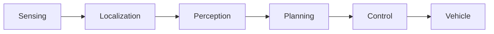

# What You Will Build

By the end of this tutorial you will have driven an autonomous vehicle twice,
without owning one.

The two simulations teach different halves of the problem, and the order
matters: **first learn what the vehicle decides, with perception and
localization taken away; then put the real world back, and watch those two
become the hard part.**

## The two simulations

| | Planning simulation | Logging simulation |
|---|---|---|
| **Teaches** | the planning component | what a real drive looks like |
| **Where the world comes from** | a kinematic model — you place the vehicle and the obstacles | recorded real sensor data from a real drive |
| **Pose** | *given.* You set it, and it is true by construction | **estimated** from LiDAR matched against the map |
| **Objects** | dummy cars you place by clicking | detected by perception, imperfectly |
| **What can go wrong** | routes, behaviors, trajectories | initialisation, scan matching, timing |
| **Needs** | the lanelet2 map only | the map, the point cloud map, a 2.8 GB rosbag |
| **GPU** | not needed | not needed if you pass two arguments |
| **Roughly** | a minute to start | a minute to start, then a 157 s replay |

The distinction that matters most is the **pose** row. In the planning
simulation the vehicle's position is something you assert; nothing can be wrong
with it. In the logging simulation the vehicle has to work out where it is from
LiDAR returns, and that estimate can be wrong, late, or lost — which is why the
second simulation feels like a real vehicle and the first does not.

## What each exercises

Against [the Autoware pipeline](../concepts/autoware-conventions.md):

**Planning simulation** — sensing, localization and perception are replaced by
your mouse. Planning and control run for real.

**Logging simulation** — everything runs for real except the vehicle interface;
sensing is fed from a recording instead of from hardware.

Neither drives a physical vehicle. That is the whole point: every part of the
stack except the actuators can be exercised at a desk.

## What you need

- A machine that completed [the installation](../getting-started/installation/overview.md)
  and [verification](../getting-started/installation/verify.md)
- A terminal with [the environment sourced](../concepts/environment.md) — two
  lines, and everything on this page depends on them
- For the logging simulation, the COSS rosbag: `just bag download`, about
  2.8 GB, fetched automatically by step 1

You do **not** need a vehicle, a LiDAR, a camera, or a GPU.

## The map and the recording

Both simulations use the same site: **COSS Park**, in `data/COSS-map-planning`.
Do not be misled by the directory's name — it holds the road network *and* the
point cloud map *and* an occupancy grid, and each simulation uses a different
one. [Step 5](./05-map-and-rosbag.md) opens it up.

The recording is 157 seconds from a real drive there. Worth knowing before you
watch it: **the vehicle is parked for the first 116 seconds**, then drives for
41 seconds at up to 1.58 m/s. Two minutes of a stationary vehicle is the correct
behaviour, not a broken replay.

## The order

1. **[First Run](./01-first-run.md)** — one command that does everything, so you
   see the finished thing working before you take it apart
2. **[Planning Simulation](./02-planning-simulation.md)** — the planning
   component, on its own
3. **[Logging Simulation](./03-logging-simulation.md)** — real sensor data, and
   localization that has to earn its answer
4. **[Behind the Recipe](./04-behind-the-recipe.md)** — what that first command
   actually ran, layer by layer
5. **[The Map and the Rosbag](./05-map-and-rosbag.md)** — what the data is
6. **[play_launch](./06-play-launch.md)** — the launcher this project uses, and
   when not to

Steps 1–3 are the tutorial proper. Steps 4–6 explain what you have been doing,
and are what you will need when something eventually fails.
