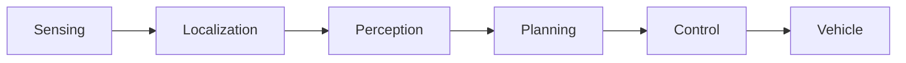

<!--
Translation Metadata:
- Source file: 00-what-you-will-build.md
- Last synced: 2026-09-12
- Translator: Claude (Anthropic)
- Status: Complete
-->

# 你將建立什麼

讀完這份教學，你會在沒有擁有一台自駕車的情況下，駕駛它兩次。

這兩種模擬各教你問題的一半，而順序很重要：**先學車輛如何決策，把感知與定位拿掉；
再把真實世界放回去，看著那兩者變成最難的部分。**

## 兩種模擬

| | 路徑規劃模擬 | 記錄回放模擬 |
|---|---|---|
| **教什麼** | 規劃組件 | 真實行駛長什麼樣子 |
| **世界從哪來** | 一個運動學模型——車輛與障礙物都由你放置 | 真實行駛錄下來的真實感測器資料 |
| **姿態** | *給定*。你設定它，它依定義為真 | **估計**，由 LiDAR 對地圖匹配得出 |
| **物件** | 你點出來的假車 | 由感知偵測，並不完美 |
| **可能出錯的地方** | 路線、行為、軌跡 | 初始化、掃描匹配、時序 |
| **需要** | 只要 lanelet2 地圖 | 地圖、點雲地圖、2.8 GB 的 rosbag |
| **GPU** | 不需要 | 傳兩個參數就不需要 |
| **大約** | 一分鐘啟動 | 一分鐘啟動，接著 157 秒回放 |

其中差別最大的是**姿態**那一列。在路徑規劃模擬中，車輛的位置是你斷言的；它不可能
出錯。在記錄回放模擬中，車輛必須從 LiDAR 回波推算自己在哪裡，而那個估計可能錯誤、
延遲或完全失去。這就是為什麼第二種模擬感覺像真的車，而第一種不像。

## 各自運作到什麼

對照 [Autoware 管線](../concepts/autoware-conventions.md)：

**路徑規劃模擬** —— 感測、定位與感知都被你的滑鼠取代。規劃與控制是真的在跑。

**記錄回放模擬** —— 除了車輛介面之外一切都真的在跑；感測端由錄製資料餵入，而不是
硬體。

兩者都不會驅動實體車輛。這正是重點：除了致動器之外，整個堆疊的每一部分都可以在
桌上運作。

## 你需要什麼

- 一台已完成[安裝](../getting-started/installation/overview.md)與
  [驗證](../getting-started/installation/verify.md)的機器
- 一個已[載入環境](../concepts/environment.md)的終端機——兩行，而本頁的一切都
  依賴它們
- 記錄回放模擬需要 COSS rosbag：`just bag download`，約 2.8 GB，步驟 1 會自動取得

你**不需要**車輛、LiDAR、相機或 GPU。

## 地圖與錄製

兩種模擬使用同一個場地：**COSS Park**，位於 `data/COSS-map-planning`。別被目錄
名稱誤導——它同時包含道路網*與*點雲地圖*與*一張佔據網格，而每種模擬各用其中一種。
[步驟 5](./05-map-and-rosbag.md) 會打開它來看。

錄製是在那裡實際行駛的 157 秒。在你觀看之前值得知道：**車輛在前 116 秒是停著的**，
接著行駛 41 秒，最高 1.58 m/s。兩分鐘的靜止車輛是正確的行為，不是壞掉的回放。

## 順序

1. **[第一次執行](./01-first-run.md)** —— 一條指令做完所有事，讓你在拆解之前先看到
   成品運作
2. **[路徑規劃模擬](./02-planning-simulation.md)** —— 規劃組件，單獨看
3. **[記錄回放模擬](./03-logging-simulation.md)** —— 真實感測器資料，以及必須靠自己
   得出答案的定位
4. **[拆解那條指令](./04-behind-the-recipe.md)** —— 第一條指令實際執行了什麼，一層
   一層看
5. **[地圖與 Rosbag](./05-map-and-rosbag.md)** —— 這些資料是什麼
6. **[play_launch](./06-play-launch.md)** —— 本專案使用的啟動器，以及何時不要用它

步驟 1–3 是教學本體。步驟 4–6 解釋你一直在做的事，也是某天出問題時你會需要的。
