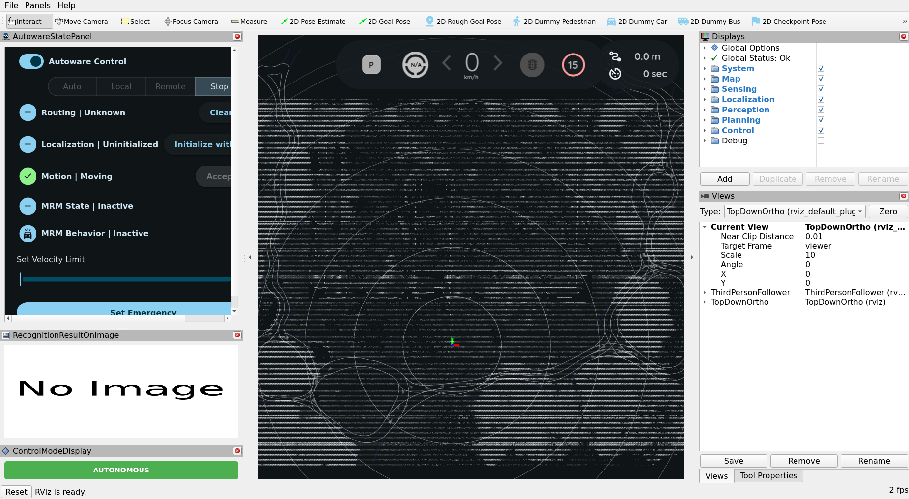
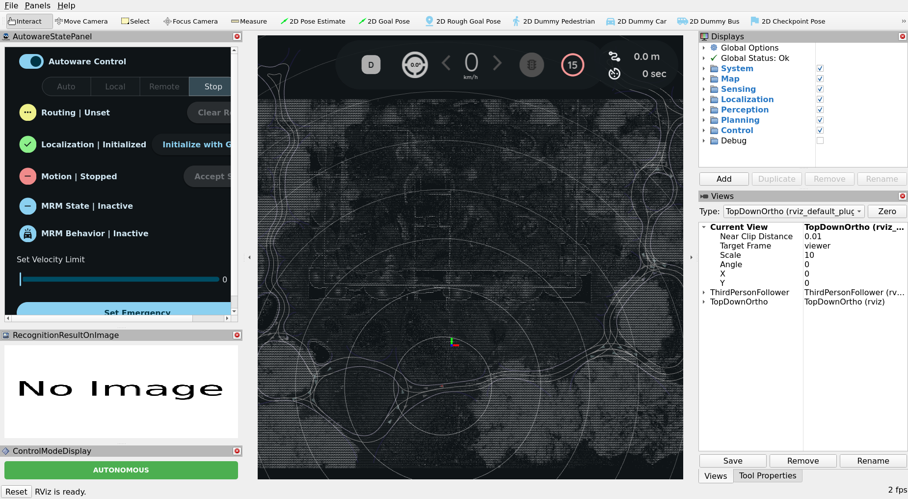

<!--
Translation Metadata:
- Source file: 02-planning-simulation.md
- Last synced: 2026-09-14
- Translator: Claude (Anthropic)
- Status: Complete
-->

# 2. 路徑規劃模擬

單獨看規劃組件。

這裡沒有感測器、沒有定位、也沒有感知。你告訴車輛它在哪、要去哪；它算出一條路線、
把它變成軌跡，然後跟著走。因為姿態是*給定*的，位置不可能出錯——所以任何出錯的東西
都是一個規劃決策，而這正是這裡適合學規劃的原因。

它不需要 GPU、不需要 rosbag、也不需要感測器。

<figure style="text-align: center; margin: 1.5em auto; max-width: 960px;">
  <video autoplay loop muted playsinline controls style="width: 100%; border-radius: 8px;">
    <source src="../../../figures/planning_sim_video/planning-sim.webm" type="video/webm">
  </video>
  <figcaption>整頁的流程：從儲存庫根目錄啟動、放置車輛、給它一個目標、切到自動駕駛，然後看它開到目的地。</figcaption>
</figure>

## 啟動

```bash
source /opt/autoware/1.5.0/setup.bash
source install/setup.bash

play_launch launch autoware_launch planning_simulator.launch.xml \
  map_path:=$PWD/data/COSS-map-planning \
  vehicle_model:=autosdv_vehicle \
  sensor_model:=autosdv_sensor_kit
```

把那道指令分成四個部分來讀，因為本書裡每一道啟動指令都是同樣的形狀：

```
play_launch launch   <package>         <launch file>                  <arg>:=<value> ...
             ^                          ^                              ^
             the verb                   a file inside that package     launch arguments
```

也就是：動詞、套件名稱、該套件裡的啟動檔，以及啟動參數。

`play_launch launch` 接一個套件名稱與該套件裡的啟動檔，後面接任意數量的
`name:=value` 參數——文法和 `ros2 launch` 相同，你也可以直接換成它（[為什麼本書
用 `play_launch`](../getting-started/usage.md)）。

那三個參數就是全部的設定：用哪張地圖、哪個車輛描述、哪個感測器套件描述。

注意套件是 `autoware_launch`——這個啟動檔來自 Autoware 本身。讓它成為一個 *AutoSDV*
模擬的是 `vehicle_model:=autosdv_vehicle`，它提供真實車輛的尺寸、軸距與轉向極限，
所以你看到的軌跡是這台車真的能跟隨的。

??? note "`just` 捷徑"

    ```bash
    just coss planning-sim
    ```

    同樣的指令，另外加上 `--web-addr 0.0.0.0:8081`。等你走完這份教學，就用它。

在一台桌機上，啟動器會在一兩秒內回報所有節點就緒——34 個節點、15 個容器、70 個
可組合節點——而 RViz 視窗大約一分鐘內可用。

## 你正在看什麼



有四個區域重要。

**工具列**，在最上方。`Interact`、`Move Camera`、`Select`、`Focus Camera`、
`Measure`，接著是你會用到的那些：**`2D Pose Estimate`**、**`2D Goal Pose`**、
`2D Rough Goal Pose`、`2D Dummy Pedestrian`、**`2D Dummy Car`**、`2D Dummy Bus`、
`2D Checkpoint Pose`。

**AutowareStatePanel**，在左側。這是要盯著看的東西，啟動時它顯示：

| 欄位 | 啟動時 |
|---|---|
| Autoware Control | 開 |
| *（模式按鈕）* | `Auto` `Local` `Remote` `Stop`——選中 `Stop` |
| Routing | **Unknown** |
| Localization | **Uninitialized** |
| Motion | Moving |
| MRM State / Behavior | Inactive |

**3D 檢視**，在中間，從上方顯示 COSS Park 的 lanelet 地圖。白線是車道邊界。目前還
沒有車輛，因為定位尚未初始化。

**Displays 面板**，在右側，每個管線組件一個群組——System、Map、Sensing、
Localization、Perception、Planning、Control。那些正是
[主題所使用的組件名稱](../concepts/autoware-conventions.md)。

## 步驟 1 —— 放置車輛

點選工具列的 **`2D Pose Estimate`**，然後在地圖上**按住並拖曳**：按下的位置決定
位置，拖曳的方向決定朝向。放開。

面板隨之改變：



| 欄位 | 之前 | 之後 |
|---|---|---|
| Localization | Uninitialized | **Initialized** ✓ |
| Routing | Unknown | **Unset** |
| Motion | Moving | **Stopped** |
| 檔位 | `P` | **`D`** |

車輛現在存在了、靜止、掛在前進檔，而且無處可去。

盯著那個面板，而不是地圖。這份教學的每個步驟都會先在那裡顯示出來，而當某件事不成功
時，幾乎都是因為某個你預期會改變的欄位沒有改變。

!!! note "還有一個 `Initialize with GNSS` 按鈕"

    就在 Localization 那一列旁邊。它是給戶外、有定位訊號的真實車輛用的。在模擬中
    沒有 GNSS，所以請手動放置姿態。

## 步驟 2 —— 給它一個目標

點選 **`2D Goal Pose`**，然後在道路上別處按住並拖曳——同樣地，拖曳決定車輛抵達時
要面向哪邊。

會出現兩樣東西，而它們之間的差別正是規劃的核心：

- **路線（route）** —— 從這裡到那裡的車道序列，依 lanelet 地圖計算一次。除非你更改
  目標，否則它不會變。
- **軌跡（trajectory）** —— 帶有沿途速度的實際路徑，持續重新計算。這才是控制器跟隨
  的東西。

面板中的 `Routing` 會變成 **Set**。

### 什麼都沒出現的時候

被拒絕的目標什麼都不會說——沒有訊息、沒有標記，`Routing` 就只是停在 `Unset`。原因
有兩個，而它們需要不同的處理。

**目標不在 lanelet 裡面。** 「看起來像路」並不夠：目標必須落在地圖定義的車道範圍
內，而在這張地圖上那個範圍比看起來窄。朝向反而寬鬆——大約車道方向 ±45° 都會被接
受——所以失敗幾乎都是位置。請點在車道中間，而不是界線上。

**stack 還沒準備好。** mission planner 在啟動後大約需要一分鐘才會接受任何東西，在
那之前送出的目標會被拒絕，表現得和目標離開道路一模一樣。等一下再點一次；剛才失敗
的同一個目標就會生效。

!!! tip "一組已知可行的目標"

    如果你想先把教學看完、之後再找可行的位置，就用這一組。寫這一頁時實際跑過：
    28.4 公尺、最高 3.12 m/s，抵達誤差 0.1 公尺以內。

    | | x | y | 朝向 |
    |---|---|---|---|
    | 初始位姿 | −1.84 | −8.28 | 約 175° |
    | 目標 | −27.9 | −4.4 | 約 135° |

    座標是 `map` 座標系中的公尺，原點由 `map_projector_info.yaml`
    固定——見[地圖與 Rosbag](./05-map-and-rosbag.md)。你是在 RViz 裡用眼睛放的，
    誤差一公尺左右就夠了。

## 步驟 3 —— 開車

點選 AutowareStatePanel 中的 **`Auto`**。

車輛開始跟隨軌跡。注意檢視上方的速度表，以及會變成 `Moving` 的 `Motion` 欄位。

**如果第一次點下去沒反應，就再點一次。** 當操作模式還在切換中時，engage 會被拒絕
——而路線設定完之後的一兩秒正是切換中——並且這個拒絕是無聲的。過一會兒再點一次就
會生效。

如果還是不動，答案就在面板上。`Routing | Unset` 表示沒有目標生效。
`Localization | Uninitialized` 表示步驟 1 沒有生效。這兩者都比真正的規劃失敗常見。

## 現在來實驗

這是最值得花時間的部分。唯一在跑的是規劃器，所以你看到的一切都是規劃器。

### 放一個障礙物在路中間

選擇 **`2D Dummy Car`** 並點在車輛前方的道路上。

看看發生什麼：**路線不會變**——車道還是那些車道——但**軌跡**會變。依可用空間多寡，
車輛會減速、停下，或繞過去。那就是步驟 2 中那個區別的具體呈現。

`2D Dummy Pedestrian` 與 `2D Dummy Bus` 做同樣的事，但佔用面積與行為規則不同。

### 行駛中更換目標

在車輛移動時設定一個新的 `2D Goal Pose`。路線會從目前位置重新規劃。

### 在第二個終端機中觀察管線

```bash
source /opt/autoware/1.5.0/setup.bash && source install/setup.bash

ros2 topic echo /planning/scenario_planning/trajectory --once
ros2 topic echo /control/command/control_cmd --once
ros2 topic hz /control/command/control_cmd
```

軌跡是規劃器的輸出；控制命令是控制器由它推導出的。在真實車輛上，那個命令會送到
致動器。

這也是命名慣例回報你的時刻——`/planning/…` 與 `/control/…` 在你對其他事一無所知時，
就告訴你是哪個組件產出了什麼。參閱
[Autoware 管線](../concepts/autoware-conventions.md)。

## 停止

在 `play_launch` 的終端機按 `Ctrl-C`，然後確認沒有殘留：

```bash
ros2 node list    # 應為空
```

## 這一步沒有測試到什麼

所有跟真實世界有關的東西：

- **定位** —— 姿態是你斷言的；沒有任何感測器需要找出它
- **感知** —— 障礙物是因為你點了才出現，完全已知
- **感測** —— 沒有驅動程式執行，沒有點雲存在

而那正是下一頁的重點：同樣的堆疊，把這三者放回去，並用一段真實行駛的錄製來餵它們。

**接下來：** [3. 記錄回放模擬](./03-logging-simulation.md)
